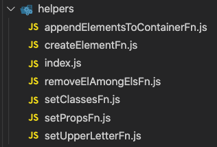
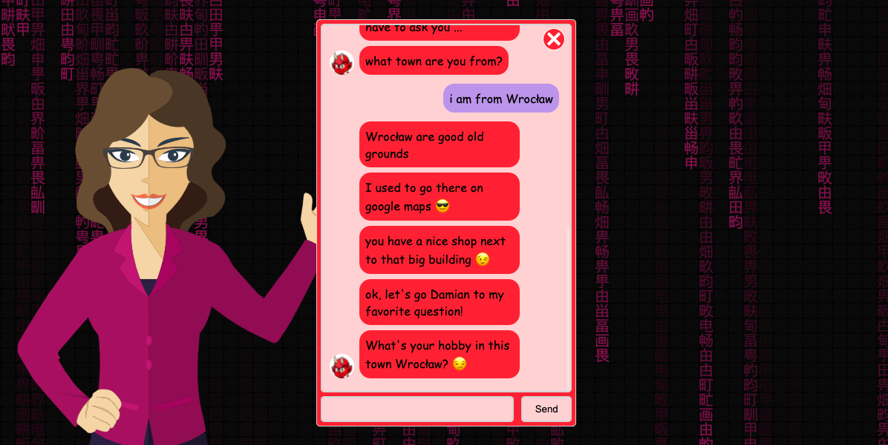

# Talk-to-Gisapia-and-the-Others

Desktop version:


<br/>

Mobile version:


The application allows you to write (PL / ENG) with 3 different characters who can collect information provided via the messenger and send the collected data to the e-mail provided by the user.

Live version is available [here](https://talktogisapiaandtheothers.pl/).

<br/>

## Table of Contents

1. General info
2. Technologies
3. Setup
4. Features

   <br/>

## 1. General info

The main purpose of the application is to collect various data from the user during a conversation with characters and send this data to the user's e-mail.

<br/>

## 2. Technologies

The following technologies were used in the project:

- HTML
- CSS
- Javascript (OOP)
- GSAP

  <br/>

## 3. Setup

You don't need any commands to run this project

<br/>

## 4. Features

Most of the project is built in oop javascript for a very in-depth understanding of the language. The list of the most interesting solutions is presented below:

&nbsp; &nbsp; &nbsp; &nbsp; 4.1. Helpers <br/>
&nbsp; &nbsp; &nbsp; &nbsp; 4.2. Matrix background <br/>
&nbsp; &nbsp; &nbsp; &nbsp; 4.3. GSAP for Gisapia animation <br/>
&nbsp; &nbsp; &nbsp; &nbsp; 4.4. Inheritance of traits by any character <br/>
&nbsp; &nbsp; &nbsp; &nbsp; 4.5. Factory design pattern when selecting a character <br/>
&nbsp; &nbsp; &nbsp; &nbsp; 4.6. Singleton design pattern while saving the settings <br/>
&nbsp; &nbsp; &nbsp; &nbsp; 4.7. Observer design pattern during various events <br/>
&nbsp; &nbsp; &nbsp; &nbsp; 4.8. Character script and email template <br/>
&nbsp; &nbsp; &nbsp; &nbsp; 4.9. The way of writing a message <br/>
&nbsp; &nbsp; &nbsp; &nbsp; 4.10. Adding words to character memory <br/>
&nbsp; &nbsp; &nbsp; &nbsp; 4.11. Sending user data by e-mail <br/>
&nbsp; &nbsp; &nbsp; &nbsp; 4.12. The ability to change characters during the conversation <br/>
&nbsp; &nbsp; &nbsp; &nbsp; 4.13. Opportunity to talk again with characters <br/>

<br/>

### 4.1. Helpers

Due to the fact that most of the operations in the code are repeated, functions have been separated in the helpers folder, which are reusable throughout the project. Here are some examples of helper functions:



<br/>

The function that plays the biggest role in the project is createElementFn.js, which is responsible for creating html elements with all properties in js classes.

<br/>

Below is the code example (helpers/createElementFn.js):

```
export default ({ element, ...rest }) => {
  const createdElement = document.createElement(element)

  if (Object.keys(rest).length) {
    for (const propEl in rest) {
      switch (propEl) {
        case 'listeners':
          rest[propEl].map((listener) => {
            const { event, cb } = listener
            createdElement.addEventListener(event, (e) => {
              cb(e)
            })
          })
          break

        case 'attributes':
          rest[propEl].map((attribute) => {
            createdElement.setAttribute(
              `${attribute.type}`,
              `${attribute.name}`
            )
          })
          break

        case 'classes':
          createdElement.classList.add(...rest[propEl])
          break

        case 'styles':
          rest[propEl].map((styleObj) => {
            createdElement.style[styleObj.name] = styleObj.value
          })
          break

        default:
          createdElement[propEl] = rest[propEl]
          break
      }
    }
  }
  return createdElement
}
```

<br/>

The following is an example of using createElementFn when creating an input element with different properties (objects/MessengerInterface.js):

```
this.input = createElementFn({
  element: 'input',
  disabled: true,
  classes: [classNames.messenger.interfaceInput],
  listeners: [
    {
      event: 'input',
      cb: (e) => {
        this.inputValue = e.target.value
      },
    },
    {
      event: 'keypress',
      cb: (e) => {
        if (e.key === 'Enter') {
          if (this.isCorrectInputValue()) {
            this.callSubscribers()
          }
        }
      },
    },
  ],
})
```

As we can see in the above example, we can create an html element with many properties for example with two event listeners.

Also in the example above, you can see that classes are in the form of objects. This solution was introduced to avoid mistakes that can be made in the string type.

<br/>

Below is an exemplary list of such classes in the form of objects (data/global/names.js):

```
export const classNames = {
  messenger: {
    main: 'messenger',
    inner: 'messenger-inner',
    screen: 'messenger-screen',
    screenInner: 'messenger-screen-inner',
    messageContainer: 'messenger-message-container',
    message: 'messenger-message',
    avatar: 'messenger-avatar',
    loaderContainer: 'messenger-loader-container',
    loader: 'messenger-loader',
    interface: 'messenger-interface',
    interfaceInput: 'messenger-interface-input',
    interfaceBtn: 'messenger-interface-btn',
    backIcon: 'messenger-backIcon',
    spinnerContainer: 'messenger-spinner-container',
    spinner: 'messenger-spinner',
  },

  selectCharUI: {
    main: 'selectCharUI',
    headline: 'selectCharUI-headline',
    messageContainer: 'selectCharUI-message-container',
    message: 'selectCharUI-message',
    startBtn: 'selectCharUI-startBtn',
    selectBtn: 'selectCharUI-selectBtn',
    selectBtnActive: 'selectCharUI-selectBtn-active',
    startBtnReady: 'selectCharUI-startBtn-ready',
    plLngBtn: 'selectCharUI-plLngBtn',
    engLngBtn: 'selectCharUI-engLngBtn',
    lngBtnActive: 'selectCharUI-lngBtn-active',
  },

  privatePolicy: {
    main: 'privatePolicy',
    linkContainer: 'privatePolicy-link-container',
    link: 'privatePolicy-link',
    headline: 'privatePolicy-headline',
    paragraph: 'privatePolicy-paragraph',
  },
}
```

<br/>

### 4.2. Matrix background

In the application, to increase the user experience, a background was created that imitates the background of the matrix film in a slightly different color.

<br/>

Below is a visual example of this solution:


<br/>

In order to be able to get the phenomenon shown in the example above, the Background object with many methods was created (objects / Background.js):

```
class Background {
  constructor() {
    this.canvas = document.getElementById('canvas')
    this.cxt = canvas.getContext('2d')
    this.canvas.width = window.innerWidth
    this.canvas.height = window.innerHeight
    this.chinese =
      '田由甲申甴电甶男甸甹町画甼甽甾甿畀畁畂畃畄畅畆畇畈畉畊畋界畍畎畏畐畑'
    this.chinese = this.chinese.split('')
    this.font_size = 20
    this.columns = this.canvas.width / this.font_size
    this.drops = this.addDrops()
    this.draw()
    this.resize()
  }

  resize() {
    window.addEventListener('resize', () => {
      this.canvas.width = window.innerWidth
      this.canvas.height = window.innerHeight
      this.columns = this.canvas.width / this.font_size
      this.drops = this.addDrops()
    })
  }

  addDrops() {
    let drops = []
    for (let i = 0; i < this.columns; i++) {
      drops[i] = 1
    }
    return drops
  }

  draw(time = 33) {
    setInterval(() => {
      this.cxt.fillStyle = 'rgba(0,0,0,0.05)'
      this.cxt.fillRect(0, 0, this.canvas.width, this.canvas.height)

      this.cxt.fillStyle = 'rgb(132, 42, 86)'
      this.cxt.font = this.font_size + 'px arial'

      for (let i = 0; i < this.drops.length; i++) {
        let text = this.chinese[Math.floor(Math.random() * this.chinese.length)]
        this.cxt.fillText(
          text,
          i * this.font_size,
          this.drops[i] * this.font_size
        )

        if (
          this.drops[i] * this.font_size > this.canvas.height &&
          Math.random() > 0.975
        )
          this.drops[i] = 0

        this.drops[i]++
      }
    }, time)
  }
}

export default Background
```

The whole above solution is based on infinitely creating characters (on created canvas element) depending on the screen width using the setTimeout function.

Due to the possible change of the screen width when using the application, a method has been created that starts the character creation process from the beginning to avoid resolution distortions (resize method).

<br/>

### 4.3. GSAP for Gisapia animation

The project uses GSAP animation to animate Gisapia svg image to enhance user experiene.

Below is a visual representation of this solution:


<br/>

The code-side solution looks like this (objects/GisapiaAnimation.js):

```
class GisapiaAnimation {
  constructor() {
    this.gisapiaObject = this.getObjectContent()
    this.lips = this.gisapiaObject.querySelector('#lips')
    this.rightHand = this.gisapiaObject.querySelector('#right-hand')
    this.hair = this.gisapiaObject.querySelector('#hair')
    this.eyes = this.gisapiaObject.querySelector('#eyes')
    this.animation = this.startAnimation()
  }

  getObjectContent() {
    return document.querySelector('#gisapia').contentDocument
  }

  startAnimation() {
    this.master = new TimelineMax()
    this.master
      .add('startAnimation')
      .add(this.lipsAnimation(), 'startAnimation')
      .add(this.rightHandAnimation(), 'startAnimation')
      .add(this.hairAnimation(), 'startAnimation')
      .add(this.eyesAnimation(), 'startAnimation')
  }

  lipsAnimation = () => {
    const tl = new TimelineMax({
      onComplete: this.lipsAnimation,
    })
    tl.to(this.lips, 0.1, {
      scale: this.setScale(0.2, 1),
      yoyo: true,
      transformOrigin: '50% 50%',
    })
    return tl
  }

  rightHandAnimation = () => {
    const tl = new TimelineMax()
    tl.set(this.rightHand, {
      rotation: -10,
      transformOrigin: '5% 100%',
    }).to(this.rightHand, 0.5, {
      rotation: 10,
      transformOrigin: '5% 100%',
      yoyo: true,
      repeat: -1,
      ease: Power0.easeIn,
    })
    return tl
  }

  hairAnimation = () => {
    const tl = new TimelineMax({
      onComplete: this.hairAnimation,
    })
    tl.to(this.hair, 1, {
      scale: this.setScale(0.03, 0.97),
      transformOrigin: '50% 50%',
    })
    return tl
  }

  eyesAnimation = () => {
    const tl = new TimelineMax({
      onComplete: this.eyesAnimation,
    })
    tl.to(this.eyes, 1, {
      scale: this.setScale(0.05, 1),
      transformOrigin: '50% 50%',
    })
    return tl
  }

  setScale(...values) {
    return Math.random() * values[0] + values[1]
  }
}

export default GisapiaAnimation
```

<br/>

We can see in the example above many methods that are responsible for the looping movement of individual parts of the character. Animation involves the movement of the lips, hair, right hand and hair.

<br/>

### 4.4. Inheritance of traits by any character

There are 3 characters in the app that we can chat with. Due to the very high similarity of character traits, a general object called Character was created, from which each character inherits the traits.

<br/>

Below is an example of this global character class (objects/characters/Character.js):

```
import { messages, answers, categories } from '/data/global/names.js'

class Character {
  constructor(scriptTalk, charMemory, memory) {
    this.scriptTalk = scriptTalk
    this.charMemory = charMemory
    this.memory = memory
  }

  deleteMemoryAboutUser() {
    this.charMemory.aboutUser = {}
  }

  setScriptTalk() {
    this.scriptTalkCopy = JSON.parse(JSON.stringify(this.scriptTalk))
    this.modifiedScriptTalk = this.setScriptTalkMessages(
      this.scriptTalkCopy[this.memory.getLanguage()]
    )
  }

  getMemoryAboutUser() {
    return this.charMemory.aboutUser
  }

  changeTimeForTyping(timeForTyping) {
    const timeForReduceTyping = 100 * Math.floor(Math.random() * 10 + 5)
    const result = timeForTyping - timeForReduceTyping

    return result < 1000 ? 1000 : result
  }

  getScriptTalkMessages({ category, from, type }) {
    if (from === messages) return this.modifiedScriptTalk[category].messages
    if (from === answers) return this.modifiedScriptTalk[category].answers[type]
  }

  getCurrentScriptTalkCategory(conversationStep) {
    return Object.keys(this.modifiedScriptTalk)[conversationStep]
  }

  getScriptTalkCategories() {
    const categories = {}
    Object.keys(this.modifiedScriptTalk).map(
      (categoryName) => (categories[categoryName] = categoryName)
    )

    return categories
  }

  mustThink(time) {
    return new Promise((resolve) => setTimeout(resolve, time))
  }

  checkUserMessageInMemory(scriptCategory, message) {
    return this.charMemory[scriptCategory].find((word) =>
      message.toLowerCase().includes(word.toLowerCase())
    )
  }

  addToMemoryAboutUser(scriptCategory, word) {
    if (scriptCategory !== categories.hobby) {
      word = this.setUpperLetter(word)
    }

    this.charMemory.aboutUser[scriptCategory] = word
  }

  setUpperLetter(message) {
    return message.charAt(0).toUpperCase() + message.slice(1)
  }

  countTypingQuantity(textLength) {
    let result
    if (textLength < 20) {
      result = 1
    } else if (textLength < 80) {
      result = 2
    } else {
      result = 3
    }

    return result
  }

  countTimeForTyping(textLength, speed) {
    const result = textLength * speed

    return result > 2500 ? 2500 : result < 1000 ? 1000 : result
  }

  setScriptTalkMessages(scriptTalk) {
    for (const category in scriptTalk) {
      const messageNumber = Math.floor(
        Math.random() * scriptTalk[category].messages.length
      )
      const selectedMessage = scriptTalk[category].messages[messageNumber]

      scriptTalk[category].messages = selectedMessage

      for (const answerVariants in scriptTalk[category].answers) {
        const answerNumber = Math.floor(
          Math.random() * scriptTalk[category].answers[answerVariants].length
        )
        const selectedAnswer =
          scriptTalk[category].answers[answerVariants][answerNumber]

        scriptTalk[category].answers[answerVariants] = selectedAnswer
      }
    }
    return scriptTalk
  }

  findWordAndReplace({ wordsSets }, messages) {
    return messages.map((message) => {
      wordsSets.forEach((wordSet) => {
        if (message.includes(wordSet.search)) {
          const regexp = new RegExp(wordSet.search, 'gi')
          message = message.replace(regexp, wordSet.replace)
        }
      })

      return message
    })
  }

  changeScriptTalkMessages({ category, from, type }) {
    const wordsToSearchAndReplace = Object.keys(this.charMemory.aboutUser).map(
      (category) => {
        return {
          search: `-user${this.setUpperLetter(category)}-`,
          replace: this.charMemory.aboutUser[category],
        }
      }
    )
    if (wordsToSearchAndReplace.length === 0) return

    if (from === messages) {
      this.modifiedScriptTalk[category].messages = this.findWordAndReplace(
        { wordsSets: wordsToSearchAndReplace },
        this.modifiedScriptTalk[category].messages
      )
    }

    if (from === answers) {
      this.modifiedScriptTalk[category].answers[type] = this.findWordAndReplace(
        { wordsSets: wordsToSearchAndReplace },
        this.modifiedScriptTalk[category].answers[type]
      )
    }
  }
}

export default Character
```

<br/>

As we can see in the example above, we have a lot of methods that are identical for each character. For this reason, this design pattern was used in order not to duplicate the code unnecessarily.

<br/>

Below is an example of inheritance by a Gisapia character (objects/characters/Gisapia.js):

```
import Character from './Character.js'
import { charNames, src } from '/data/global/names.js'

class Gisapia extends Character {
  constructor(scriptTalk, charMemory, memory) {
    super(scriptTalk, charMemory, memory)
    this.name = charNames.Gisapia
    this.avatar = src.characters.gisapia.avatar
  }
}

export default Gisapia
```

<br/>

### 4.5. Factory design pattern when selecting a character

Each available character in the application is created on the basis of the Factory Design Pattern.

When the user selects a character, the getChar method returns the appropriate character class.

<br/>

The example below shows this solution (objects/CharsFactory.js):

```
import { Gisapia, NullCharacter, Hookin, Reduxon } from './index.js'
import {
  gisapiaScriptTalk,
  gisapiaMemory,
  gisapiaEmail,
} from '/data/characters/gisapia/index.js'
import {
  hookinScriptTalk,
  hookinMemory,
  hookinEmail,
} from '/data/characters/hookin/index.js'
import {
  reduxonScriptTalk,
  reduxonMemory,
  reduxonEmail,
} from '/data/characters/reduxon/index.js'
import { charNames } from '/data/global/names.js'

class CharsFactory {
  constructor(memory) {
    this.gisapia = new Gisapia(
      gisapiaScriptTalk,
      gisapiaEmail,
      gisapiaMemory,
      memory
    )
    this.hookin = new Hookin(
      hookinScriptTalk,
      hookinEmail,
      hookinMemory,
      memory
    )
    this.reduxon = new Reduxon(
      reduxonScriptTalk,
      reduxonEmail,
      reduxonMemory,
      memory
    )
    this.nullCharacter = new NullCharacter()
  }

  getChar(charName) {
    switch (charName) {
      case charNames.Gisapia:
        return this.gisapia
      case charNames.Hookin:
        return this.hookin
      case charNames.Reduxon:
        return this.reduxon
      default:
        return this.nullCharacter
    }
  }
}

export default CharsFactory

```

As we can see in the above example, each character receives initial data in the form of a script, global memory, personal memory and email (finally sent to the user).

<br/>

The choice of characters is made by using the observer design pattern, which is described later.

Below is an example of this solution(scripts/index.js):

```
  const handleCharSelect = (charName) => {
    const chosenChar = charsFactory.getChar(charName)

  selectCharUI.subscribe(handleCharSelect, 'selectChar')
```

<br/>

### 4.6. Singleton design pattern while saving the settings

In order for the settings and data to be stored throughout the entire application, the Singleton Design Pattern was used.

Thanks to this, we have one instance created that cannot be overwritten when using the application.

<br/>

Below is an example of this design pattern (objects/Memory.js):

```
import { GisapiaAnimation, Background } from './index.js'
import { createElementFn } from '/scripts/helpers/index.js'
import { src } from '/data/global/names.js'

class Memory {
  constructor() {
    if (Memory.instance == null) {
      this.talkingStep = 0
      this.character = null
      this.userMessage = null
      this.isCallCharTalkingAgain = false
      this.isCharListening = false
      this.isCharTalkingFinish = false
      this.backgroundAnimation = this.background()
      this.gisapiaAnimation = this.gisapiaAnimation()
      this.language = localStorage.getItem('language') || 'pl'
      this.lngSubscribers = []
      this.createAudio()
      Memory.instance = this
    }
    return Memory.instance
  }

  createAudio() {
    this.typingAudio = createElementFn({
      element: 'audio',
      src: src.audio.typing,
    })

    this.chatBubbleAudio = createElementFn({
      element: 'audio',
      src: src.audio.chatBubble,
    })

    this.fallDownAudio = createElementFn({
      element: 'audio',
      src: src.audio.throw,
    })

    this.backgroundAudio = createElementFn({
      element: 'audio',
      src: src.audio.background,
    })

    this.finishAudio = createElementFn({
      element: 'audio',
      src: src.audio.finish,
    })

    this.clickAudio = createElementFn({
      element: 'audio',
      src: src.audio.click,
    })
  }

  playClickAudio() {
    this.clickAudio.play()
  }

  playTypingAudio() {
    this.typingAudio.play()
  }

  playChatBubbleAudio() {
    this.chatBubbleAudio.play()
  }

  playFallDownAudio() {
    this.fallDownAudio.play()
  }

  playBackgroundAudio({ pause, reload } = false) {
    if (reload) {
      this.backgroundAudio.load()
    }

    if (pause) {
      this.backgroundAudio.pause()
    } else {
      this.backgroundAudio.play()
    }
  }

  playFinishAudio({ pause, reload } = false) {
    if (reload) {
      this.finishAudio.load()
    }
    if (pause) {
      this.finishAudio.pause()
    } else {
      this.finishAudio.play()
    }
  }

  background() {
    new Background()
  }

  gisapiaAnimation() {
    new GisapiaAnimation()
  }

  increaseTalkingStep() {
    this.talkingStep++
  }

  getTalkingStep() {
    return this.talkingStep
  }

  setSelectedChar(character) {
    this.character = character
  }

  getChar() {
    return this.character
  }

  setUserMessage(message) {
    this.userMessage = message
  }

  getUserMessage() {
    return this.userMessage
  }

  setIsCallCharTalkingAgain(value) {
    this.isCallCharTalkingAgain = value
  }

  getIsCallCharTalkingAgain() {
    return this.isCallCharTalkingAgain
  }

  setIsCharListening(value) {
    this.isCharListening = value
  }

  getIsCharListening() {
    return this.isCharListening
  }

  setIsCharTalkingFinish(value) {
    this.isCharTalkingFinish = value
  }

  getIsCharTalkingFinish() {
    return this.isCharTalkingFinish
  }

  setLanguage(lng) {
    this.language = lng
    localStorage.setItem('language', lng)
  }

  getLanguage() {
    return this.language
  }

  lngSubscribe(cb) {
    this.lngSubscribers.push(cb)
  }

  changeLanguage() {
    this.lngSubscribers.map((cb) => {
      cb(this.language)
    })
  }

  restart() {
    this.talkingStep = 0
    this.character = null
    this.userMessage = null
    this.isCallCharTalkingAgain = false
    this.isCharListening = false
    this.isCharTalkingFinish = false
  }
}

const memory = new Memory()

export default memory
```

<br/>

In the example above, we can see that an instance of the Memory class can only be created once. Thanks to this, we can use such solutions as global memory for the application.

We have also methods in Memory object that allow to override the settings and can pass these settings to the entire application.

<br/>

Below we can see an example of using this solution, in which the value entered by the user is cleared, the option of restarting the conversation function and listening by the character is set (scripts/index.js):

```
  memory.setUserMessage('')
  memory.setIsCallCharTalkingAgain(true)
  memory.setIsCharListening(false)
```

In addition, the Memory object is responsible for creating sound objects that are turned on and off using appropriate methods (the methods are at the beginning of the Memory object).

<br/>

### 4.7. Observer design pattern during various events

Due to the possibility of choosing several options, the design pattern called Observer was introduced in the project.

The application listens for a character selection, specific language selection or sending messages by the user and sends the given value to the subscriber of that event.

<br/>

Below is a fragment of the MessengerInterface object, in which we can see the method responsible for subscribe and the method responsible for calling the subscribers function with the input value passed(objects/SelectCharUI.js):

```
class MessengerInterface {
  constructor(container, memory) {
    this.containerSent = document.querySelector(container)
    this.memory = memory
    this.memory.lngSubscribe((lng) => this.changeLanguage(lng))
    const messengerInterfaceElements = this.createMessengerInterfaceElements()
    this.inputValue = ''
    this.subscribers = []

    appendElementsToContainerFn(messengerInterfaceElements, this.containerSent)
  }

  callSubscribers() {
    this.subscribers.map((subscriber) => subscriber(this.inputValue))
  }

  subscribe(subscriber) {
    this.subscribers.push(subscriber)
  }
```

<br/>

The following is an example of subscribing to handleUserTalking function in relation to the object MessengerInterface (scripts/index.js):

```
 const handleUserTalking = (userMessage) => {
    const chatBubble = messengerScreen.createChatBubble(userMessage, {
      name: 'user',
    })
    memory.setUserMessage(userMessage)
    messengerScreen.attachToMessengerScreen(chatBubble)
    messengerScreen.scrollMessengerScreenContainer()
    messengerScreen.increaseCharMessagesPart()
    messengerScreen.toggleShowBackBtn('off')
    messengerInterface.toggleActivePanel('off')
    handleCharTalking()
  }

  messengerInterface.subscribe(handleUserTalking)
```

We can see that the function andleUserTalking when called via the callSubscribers method takes the value of input, thanks to which further processes in the application can appear.

</br>

### 4.8. Character script and email template

Each character in the application has its own conversation script and email template (PL / ENG).

<br/>

Below is a short fragment of the Gisapia script template (PL) (data/characters/gisapia/scriptTalk.js):

```
export default {
  pl: {
    name: {
      messages: [
        [
          'Cześć 😊',
          `nazywam się Gisapia`,
          `bardzo mi miło, że będę mogła z Tobą porozmawiać! 😎. Powiedz mi proszę jak Ci na imię?`,
        ],
        [
          'Cześć, cześć! 😊',
          'w internecie mówią na mnie Gisapia',
          'A Ty jak masz na imię? 😎',
        ],
      ],

      answers: {
        isInMemory: [
          [
            `-userName-? Naprawdę -userName-??? Moja znajoma osoba ma tak na imię! 😋`,
            `eh... ostatnio się trochę pokłócilismy 😐, ale to raczej chwilowe! 😉`,
            'dobra, nie było tematu bo się rozgadam!',
          ],
          [
            '2 lata temu rozmawiałam z osobą, która miała na imię -userName-',
            'bardzo fajna i atrakcyjna osoba... 😏',
            'ale już niestety cisza po tamtej stronie... 😓',
          ],
        ],

        isNotInMemory: [
          [
            'kurcze.. Szukam i szukam w pamięci, ale nie mogę skojarzyć... 😞',
            'jak napiszesz jeszcze raz swoje imię bez dodatkowych znaków to dodam je do pamięci i będę się tak do Ciebie potem zwracać 😊',
          ],
          [
            'wiesz co trochę osób się przewinęło przez moją pamięć, ale tego imienia niestety nie kojarzę... 😞',
            'jak napiszesz je jeszcze raz bez dodatkowych znaków to dodam je do pamięci i będę się tak do Ciebie potem zwracać 😊',
          ],
        ],
        isAddedToMemory: [
          [
            'chwilka! 🙂',
            `już sobie zapisuje imię -userName- w pamięci!`,
            'no i jest! 😎',
          ],
          [
            'poczekaj chwilkę proszę... 🙂',
            'no i jest, imię -userName- zostało zapisane w mojej pamięci! 😎',
          ],
        ],
      },
    },
  }
```

<br/>

Also below is a short fragment of the email template which is finally sent to the [Emails Handler](https://github.com/damian-lis/Emails-handler) backend application (data/characters/gisapia/email.js):

```
export default {
  pl: {
    from: 'gisapiaJS@gmail.com',
    subject: '-userName- patrz co udało mi się zapamiętać!',
    html: `
            <p> Hej -userName- tutaj Gisapia! </p>
            <div style="height:5px"></div>
            <p>Zgodnie z obietnicą przesyłam informacje jakie udało mi się zapamiętać. 😉</p>
            <p>Więc tak, masz na imię <strong>-userName-</strong> ,</p>
            <p>Twoja miejscowość zamieszkania to <strong>-userOrigin-</strong> </p>
            <p>hobby jakie uprawiasz w wolnym czasie to <strong>-userHobby-</strong> </p>
            <p>Chyba dobrze się spisałam co nie? 😃</p>
            <div style="height:5px"></div>
            <p>Dzięki wielkie za rozmowę, dobrze się bawiłam! 😎</p>
            <p>Mam nadzieję, że Ty również 😋!</p>
            `,
  },
  eng: {
    from: 'gisapiaJS@gmail.com',
    subject: '-userName- look what I was able to remember!',
    html: `
            <p> Hey -userName-, this is Gisapia! </p>
            <div style="height:5px"></div>
            <p>As promised, I am sending information that I can remember. 😉</p>
            <p>So yeah, Your name is <strong>-userName-</strong>,</p>
            <p>Your city of residence is <strong>-userOrigin-</strong>,</p>
            <p>the hobby You do in Your spare time is <strong>-userHobby-</strong>, </p>
            <p>I think that I did well did not? 😃</p>
            <div style="height:5px"></div>
            <p>Thanks so much for the interview, had a good time! 😎</p>
            <p>I hope You too 😋!</p>
            `,
  },
}
```

<br/>

In the character script template example, first of all we can see messages appear in two arrays. Thanks to this, each character who starts a conversation can draw different messages for themselves.

<br/>

Below is the method of Character object that set script template version when starting a conversation with a given character (objects/characters/Character.js):

```
 setScriptTalkMessages(scriptTalk) {
    for (const category in scriptTalk) {
      const messageNumber = Math.floor(
        Math.random() * scriptTalk[category].messages.length
      )
      const selectedMessage = scriptTalk[category].messages[messageNumber]

      scriptTalk[category].messages = selectedMessage

      for (const answerVariants in scriptTalk[category].answers) {
        const answerNumber = Math.floor(
          Math.random() * scriptTalk[category].answers[answerVariants].length
        )
        const selectedAnswer =
          scriptTalk[category].answers[answerVariants][answerNumber]

        scriptTalk[category].answers[answerVariants] = selectedAnswer
      }
    }
    return scriptTalk
  }
```

As we can see above, thanks to the use of arrays, we can easily draw a given set of messages for a given character.

<br/>

Below is an example of using this method in the setScriptTalk method, which is called when starting a conversation with the selected character (objects/characters/Character.js):

```
setScriptTalk() {
    const lng = this.memory.getLanguage()
    let scriptTalkCopy = JSON.parse(JSON.stringify(this.scriptTalk))
    this.modifiedScriptTalk = this.setScriptTalkMessages(scriptTalkCopy[lng])
  }
```

As you can see in the example above, a copy of the original script is created and it is randomly selected for the interview (so as not to overwrite the original).

<br/>

Another thing You could see in the script and email template is that some words are surrounded by "-" character. This solution makes it easier to replace the words marked with "-" into words from the user at a later time. (name, origin, hobby).

<br/>

Below are two methods of Character which enable to dynamic change script and email texts (objects/characters/Character.js):

```
 findWordAndReplace({ wordsSets, texts }) {
    if (typeof texts === 'object') {
      let textsCopy = texts
      for (const text in textsCopy) {
        wordsSets.forEach((wordSet) => {
          if (textsCopy[text].includes(wordSet.search)) {
            const regexp = new RegExp(wordSet.search, 'gi')
            textsCopy[text] = textsCopy[text].replace(regexp, wordSet.replace)
          }
        })
      }

      return textsCopy
    } else {
      let textsCopy = texts
      textsCopy.map((text) => {
        wordsSets.forEach((wordSet) => {
          if (text.includes(wordSet.search)) {
            const regexp = new RegExp(wordSet.search, 'gi')
            text = text.replace(regexp, wordSet.replace)
          }
        })
        return text
      })

      return textsCopy
    }
  }

  setWordsToSearchAndReplace() {
    return Object.keys(this.charMemory.aboutUser).map((category) => {
      return {
        search: `-user${this.setUpperLetter(category)}-`,
        replace: this.charMemory.aboutUser[category],
      }
    })
  }
```

Thanks to the setWordsToSearchAndReplace method, we can determine the words to be found (with "-" character) and we can determine which words will replace the found ones (are dynamically created from a character memory object that contains information about the user).

In the findWordAndReplace method, we provide the texts (script/email) that we want to analyze and the set of words created by the setWordsToSearchAndReplace method.

As a consequence, we obtain a new version of the script or email that contains information about the user

<br/>

Below is an example of using these methods when replacing email texts using copy of the original email texts (same as with script texts) (objects/characters/Character.js):

```
addUserDataToEmail({ lng, recipient }) {
    let emailCopy = JSON.parse(JSON.stringify(this.email[lng]))
    const wordsToSearchAndReplace = this.setWordsToSearchAndReplace()
    this.modifiedEmail = this.findWordAndReplace({
      wordsSets: wordsToSearchAndReplace,
      texts: emailCopy,
    })
    this.modifiedEmail.to = recipient
  }
```

<br/>

Below are two visual examples of the changed script template (Gisapia (PL)/Reduxon (ENG)):


<br/>



<br/>

Below are two visual examples of the changed email template (Gisapia (PL)/Reduxon (ENG)):


<br/>


<br/>


<br/>


<br/>

### 4.9. The way of writing a message

In the application introduced a feature that allows each character to imitate writing in the form of an animation of jumping dots which delays the display of the message.

<br/>

Below is a visual example of this feature:


<br/>

In the case of code, the solution is as follows (scripts/index.js):

```
 const handleCharTyping = async ({
    chosenChar,
    scriptTalkMessages,
    messengerScreen,
  }) => {
    for (let i = 0; i < scriptTalkMessages.length; i++) {
      const charMessage = scriptTalkMessages[i]
      let timeForTyping = chosenChar.countTimeForTyping(charMessage.length, 80)
      const typingQuantity = chosenChar.countTypingQuantity(charMessage.length)

      for (let i = 0; i < typingQuantity; i++) {
        if (i >= 1) {
          timeForTyping = chosenChar.changeTimeForTyping(timeForTyping)
        }

        await chosenChar.mustThink(1000)
        await messengerScreen.showTyping(timeForTyping, chosenChar.name)
      }

      const chatBubble = messengerScreen.createChatBubble(
        charMessage,
        chosenChar
      )

      messengerScreen.attachToMessengerScreen(chatBubble)
      messengerScreen.scrollMessengerScreenContainer()
    }
  }
```

As we can see in the above example in the handleCharTyping function, any composing of a message from the script is delayed by animating jumping dots and imitating the character's thinking.

The length of the animation and its frequency is determined by the length of the message recieved from the script to reflect the natural way of writing.

<br/>

Below is an example of a method that suits the creation of writing imitations (objects/MessengerScreen.js):

```
  showTyping(time, charName) {
    this.memory.playTypingAudio()
    const loader = this.createLoader(charName)
    this.attachToMessengerScreen(loader)
    this.scrollMessengerScreenContainer()
    setTimeout(() => this.removeLoader(loader), time)
    return new Promise((resolve) => setTimeout(resolve, time))
  }
```

In the example above, you can see that the balls are in the form of a loader that is created for a certain period of time, after which it is remove.

The whole solution related to stopping the handleCharTyping function is possible thanks to the introduction of the so-called waiting for promise resolve after a certain time (duration of animated jumping balls).

At the end of the handleCharTyping function after the balls animation, a chatBubble is created and attached to the messenger screen (after which the screen scrolls down).

<br/>

In the case of composing a message by a user, some of the solutions are the same, except for delaying sending the message.

Below is an example of a function that is called when the user sends a message:

```
const handleUserTalking = (userMessage) => {
    const chatBubble = messengerScreen.createChatBubble(userMessage, {
      name: 'user',
    })
    memory.setUserMessage(userMessage)
    messengerScreen.attachToMessengerScreen(chatBubble)
    messengerScreen.scrollMessengerScreenContainer()
    messengerScreen.increaseCharMessagesPart()
    messengerScreen.toggleShowBackBtn('off')
    messengerInterface.toggleActivePanel('off')
    handleCharTalking()
  }
```

As we can see in the example above, the handleUserTalking function uses similar solutions.

<br/>

### 4.10. Adding words to character memory

After characters monologue, each of them asks a question that the user has to answer in some way.

If in the user's response a given character finds a word that is stored in its memory, it will display a message that it knows the word (it will also add this word to the memory as information about the user)

<br/>

Below is an visual example how it works:


If, in the user's response, the character does not find the word that he has stored in memory, the character will ask the user to write the word, which the character will then add to memory about user.

<br/>

Below is an visual example how it works:


<br/>

The following is a collection of various data that the characters use when analyzing user responses (characters/gisapia/memory.js):

```
export default {
  name: [
    'Anna',
    'Ania',
    'Maria',
    'Katarzyna',
    'Kasia',
    'Małgorzata',
    'Małgosia',
    'Agnieszka',
    'Barbara',
    'Basia',
    'Ewa',
    'Krystyna',
    'Elżbieta',
    'Magdalena',
    'Magda',
    'Joanna',
    'Asia',
    'Zofia',
    'Aleksandra',
    'Monika',
    'Teresa',
    'Danuta',
    'Natalia',
    'Karolina',
    'Marta',
    'Beata',
    'Piotr',
    'Piotrek',
    'Krzysztof',
    'Krzysiek',
    'Andrzej',
    'Damian',
    'Tomasz',
    'Tomek',
    'Jan',
    'Janek',
    'Paweł',
    'Michał',
    'Marcin',
    'Stanisław',
    'Jakub',
    'Kuba',
    'Adam',
    'Marek',
    'Łukasz',
    'Grzegorz',
    'Mateusz',
    'Wojciech',
    'Wojtek',
    'Mariusz',
    'Dariusz',
    'Zbigniew',
    'Jerzy',
  ],
  origin: [
    'Warszawa',
    'Warszawy',
    'Kraków',
    'Krakowa',
    'Łódź',
    'Łodzi',
    'Wałbrzych',
    'Wałbrzycha',
    'Wrocław',
    'Wrocławia',
    'Poznań',
    'Poznania',
    'Gdańsk',
    'Gdańska',
    'Szczecin',
    'Szczecina',
    'Bydgoszcz',
    'Bydgoszczy',
    'Lublin',
    'Lublina',
    'Białystok',
    'Białegostoku',
  ],
  hobby: [
    'podróżowanie',
    'podróże',
    'wędkowanie',
    'wędkować',
    'góry',
    'sport',
    'aktywność fizyczna',
    'czytanie książek',
    'robótki ręczne',
    'majsterkowanie',
    'modelarstwo',
    'modelowanie',
    'ogród',
    'ogródek',
    'działka',
    'uprawa roślin i kwiatów',
    'komputery',
    'gry komputerowe',
    'granie w gry',
    'grać w gry',
    'grać na komputerze',
    'traveling',
    'travels',
    'fishing',
    'fishing',
    'mountains',
    'sport',
    'physical activity',
    'reading books',
    'needlework',
    'DIY',
    'modeling',
    'modeling',
    'garden',
    'garden',
    'plot',
    'growing plants and flowers',
    'computers',
    'computer games',
    'playing games',
    'play games',
    'play on the computer',
  ],
  aboutUser: {},
}

```

</br>

The entire process in which a character's response is dynamically created is illustrated below (script/index.js):

```
  const handleCharMessageSelection = ({
    userMessage,
    chosenChar,
    currentScriptTalkCategory,
    memory,
  }) => {
    let scriptTalkMessages
    if (userMessage) {
      const foundWordInCharMemory = chosenChar.checkUserMessageInMemory(
        currentScriptTalkCategory,
        userMessage
      )
      if (memory.getIsCharListening()) {
        scriptTalkMessages = handleCharMessageAndMemoryShaping({
          chosenChar,
          currentScriptTalkCategory,
          shaping: true,
          wordToMemory: userMessage,
          from: answers,
          answerType: answerTypes.isAddedToMemory,
        })

        memory.setUserMessage('')
        memory.setIsCallCharTalkingAgain(true)
        memory.setIsCharListening(false)
      } else if (foundWordInCharMemory) {
        scriptTalkMessages = handleCharMessageAndMemoryShaping({
          chosenChar,
          currentScriptTalkCategory,
          shaping: true,
          wordToMemory: foundWordInCharMemory,
          from: answers,
          answerType: answerTypes.isInMemory,
        })
        memory.setUserMessage('')
        memory.setIsCallCharTalkingAgain(true)
      } else {
        scriptTalkMessages = handleCharMessageAndMemoryShaping({
          chosenChar,
          currentScriptTalkCategory,
          shaping: false,
          from: answers,
          answerType: answerTypes.isNotInMemory,
        })
        memory.setIsCharListening(true)
      }
    } else {
      scriptTalkMessages = handleCharMessageAndMemoryShaping({
        chosenChar,
        currentScriptTalkCategory,
        shaping: false,
        from: messages,
      })
    }

    return scriptTalkMessages
  }
```

The handleCharMessageSelection function returns the part of the script that matches the situation (the word given by the user is in character memory or not).

The handleCharMessageAndMemoryShaping function, which is used in the middle of the discussed function, helps to select a given part of the script and helps to save user data in the character's memory.

<br/>

Saving user data is done through the Character object method, which dynamically adds a data category with the user information (objects/characters/Character.js):

```
addToMemoryAboutUser(scriptCategory, word) {
    if (scriptCategory !== categories.hobby) {
      word = this.setUpperLetter(word)
    }

    this.charMemory.aboutUser[scriptCategory] = word
  }
```

<br/>

### 4.11. Sending data by e-mail

During the conversation, the characters collect data about the user.

Depending on whether the user wishes, such data can be sent to the given e-mail via my backend [Emails Handler](https://github.com/damian-lis/Emails-handler) app, which supports the Sendgrid service.

<br/>

Below is an example of a solution thanks to which such data is sent to the backend (scripts/index.js):

```
 const handleCharSendData = async (data) => {
    return await fetch(mailEndPoint, {
      method: 'POST',
      headers: {
        'Content-Type': 'application/json',
      },

      body: JSON.stringify(data),
    })
      .then((response) => response.json())
      .then((data) => {
        if (data.success) {
          finishAnimation(mailSent)
        } else {
          finishAnimation(problemWithServer)
        }
      })
      .catch(() => {
        finishAnimation(noConnectionMessage, 1000)
      })
  }
```

As we can see above, depending on the response status, we have different messages that are displayed at the end to the user.

<br/>

Sample answers (PL/ENG) (data/global/names.js):

```
export const withoutMailMessage = {
  pl: ['Maila nie wysyłam,', 'dzięki za rozmowę 😉'],
  eng: [`I don't send the e-mail,`, `thanks for the interview! 😉`],
}

export const mailSent = {
  pl: [`Mail wysłany, sprawdź! 😋`],
  eng: [`Mail sent, check it! 😋`],
}

export const noConnectionMessage = {
  pl: [
    `Maila niestety nie otrzymasz bo nie ma połączenia z serwerem... 😕`,
    `Idę to sprawdzić... Tymczasem dzięki za rozmowę! 😉`,
  ],
  eng: [
    `Unfortunately you will not receive e-mail because there is no connection to the server ...`,
    `I'm going to check it out ... In the meantime, thanks for the interview! 😉`,
  ],
}
```

<br/>

Below is a visual examples of this answers:


<br/>


<br/>


<br/>

### 4.12. The ability to change characters during the conversation

During the conversation, we have the option of changing a given character to another.

<br/>

Below is a visual example of such a solution:


In code, this is done by resetting many parameters so that the user can start a conversation with another character again.

<br/>

Below is an example of this solution on event click (objects/MessengerScreen.js):

```
  this.backIcon = createElementFn({
      element: 'img',
      classes: [classNames.messenger.backIcon],
      src: src.messenger.backIcon,
      listeners: [
        {
          event: 'click',
          cb: () => {
            this.memory.restart()
            this.memory.playFallDownAudio()
            this.memory.playClickAudio()
            this.selectCharUI.removeActives(
              this.selectCharUI.getCharButtons(),
              classNames.selectCharUI.selectBtnActive
            )
            this.selectCharUI.toggleReadyStartCharTalkingBtn('off')
            this.messengerInterface.toggleActivePanel('off')
            this.toggleShowBackBtn('off')
            runElementsFn([
              {
                element: classReferences.selectCharUI.main,
                animation: animationSettings.selectCharUI.end,
              },
              {
                element: classReferences.messenger.main,
                animation: animationSettings.messenger.end,
              },
            ])
          },
        },
      ],
    })
```

<br/>

### 4.13. Opportunity to talk again

After the whole conversation with a given character, we have the opportunity to talk to any character again.

<br/>

Below is a visual example of this solution:


The solution in the code is very similar to the one used in the above point (4.12.).
