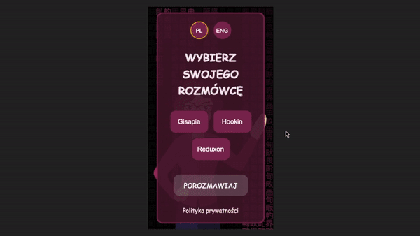
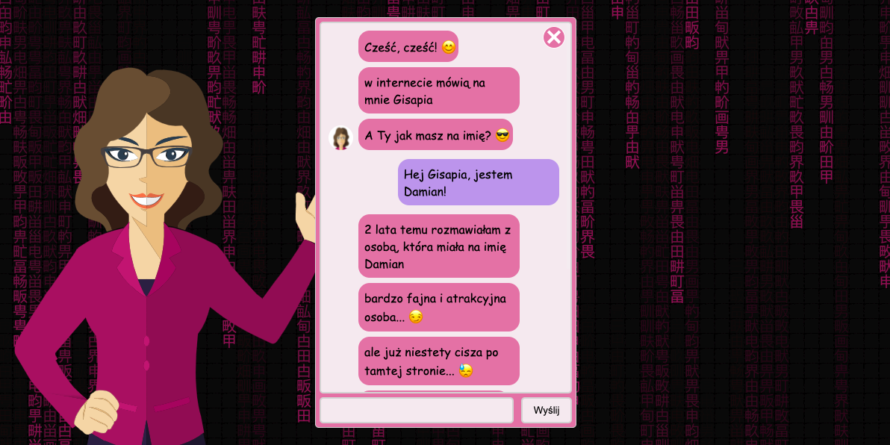

# Talk-to-Gisapia-and-the-Others

The application allows you to write in two languages (PL / ENG) with 3 different characters who can collect information provided via the messenger and send the collected data to the e-mail provided by the user.

<br/>

Desktop version:


<br/>

Mobile version:



### Live version is available [here](https://talktogisapiaandtheothers.pl/).

<br/>
<br/>

## Table of Contents

1. Technologies
2. Setup
3. Solutions

<br/>

## 1. Technologies

The following technologies were used in the project:

- HTML
- CSS
- Javascript (OOP)
- GSAP

  <br/>

## 2. Setup

You don't need any commands to run this project

<br/>

## 3. Solutions

Most of the project is built in oop javascript for a very in-depth understanding of the language. The list of the most interesting solutions is presented below:

### &nbsp; &nbsp; 3.1. General: <br/>

&nbsp; &nbsp; &nbsp; &nbsp; 3.1.1. String values in variables <br/>
&nbsp; &nbsp; &nbsp; &nbsp; 3.1.2. Helper functions <br/>
&nbsp; &nbsp; &nbsp; &nbsp; 3.1.3. The structure of styles <br/>
&nbsp; &nbsp; &nbsp; &nbsp; 3.1.4. The structure of js objects and their methods <br/>
&nbsp; &nbsp; &nbsp; &nbsp; 3.1.5. The structure of the app logic <br/>

<br/>

### &nbsp; &nbsp; 3.2. Specific: <br/>

&nbsp; &nbsp; &nbsp; &nbsp; 3.2.1. Matrix background <br/>
&nbsp; &nbsp; &nbsp; &nbsp; 3.2.2. GSAP for Gisapia animation <br/>
&nbsp; &nbsp; &nbsp; &nbsp; 3.2.3. Inheritance of traits by any character <br/>
&nbsp; &nbsp; &nbsp; &nbsp; 3.2.4. Factory design pattern when selecting a character <br/>
&nbsp; &nbsp; &nbsp; &nbsp; 3.2.5. Singleton design pattern while saving the settings <br/>
&nbsp; &nbsp; &nbsp; &nbsp; 3.2.6. Observer design pattern during various events <br/>
&nbsp; &nbsp; &nbsp; &nbsp; 3.2.7. Character talk script and email templates <br/>
&nbsp; &nbsp; &nbsp; &nbsp; 3.2.8. The way of writing a message <br/>
&nbsp; &nbsp; &nbsp; &nbsp; 3.2.9. Adding words to character memory <br/>
&nbsp; &nbsp; &nbsp; &nbsp; 3.2.10. Sending user data to user by e-mail of selected character <br/>
&nbsp; &nbsp; &nbsp; &nbsp; 3.2.11. Messages while waiting for a response from the server while sending email <br/>
&nbsp; &nbsp; &nbsp; &nbsp; 3.2.12. The ability to change characters during the conversation <br/>
&nbsp; &nbsp; &nbsp; &nbsp; 3.2.13. Opportunity to talk again with characters <br/>

<br/>
<br/>

## 3.1. General

### 3.1.1. String values in variables

In the project, almost all string values have been assigned to variables (objects properties) to avoid unwanted errors by typos. Naming such values is longer, but more secure and predictable.

<br/>

In the example below, we can see the different categories of variables (data/names.js):

```
export const common = {
  listeners: 'listeners',
  attributes: 'attributes',
  classes: 'classes',
  styles: 'styles',
  string: 'string',
  animation: 'animation',
  messages: 'messages',
  answers: 'answers',
  language: 'language',
  selectChar: 'selectChar',
  startTalking: 'startTalking',
  messagesPart: 'messagesPart',
  toBottomHide: 'toBottomHide:',
  fromBottomShow: 'fromBottomShow',
  fallFromTop: 'fallFromTop',
  BackToTheTop: 'BackToTheTop',
  startAnimation: 'startAnimation',
  id: 'id',
  main: 'main',
  second: 'second',
  ball: 'ball',
  user: 'user',

  events: {
    click: 'click',
    keypress: 'keypress',
    resize: 'resize',
    DOMContentLoaded: 'DOMContentLoaded',
  },

  types: {
    string: 'string',
    object: 'object',
  },

  props: {
    names: {
      textContent: 'textContent',
      disabled: 'disabled',
    },
  },

  styleProps: {
    names: {
      display: 'display',
      pointerEvents: 'pointerEvents',
      visibility: 'visibility',
      opacity: 'opacity',
    },
    values: {
      none: 'none',
      block: 'block',
      visible: 'visible',
      hidden: 'hidden',
      auto: 'auto',
      flex: 'flex',
      visible: 'visible',
      hidden: 'hidden',
    },

    //more code...
  },

  //more code...
}
```

<br/>
<br/>

### 3.1.2. Helper functions

Due to the fact that most of the operations in the code are repeated, functions have been separated in the helpers folder, which are reusable throughout the project. This separate notation of functions can of course be reused in subsequent projects.

Here are structure of helper functions:


The function that plays the biggest role in the project is createElementFn.js, which is responsible for creating html elements with all properties in js classes.

<br/>

Below is the code example (helpers/createElementFn.js):

```
import { common } from '/data/names.js'

export default ({ element, ...rest }) => {
  const createdElement = document.createElement(element)

  if (Object.keys(rest).length) {
    for (const propEl in rest) {
      switch (propEl) {
        case common.listeners:
          rest[propEl].map((listener) => {
            const { event, cb } = listener
            createdElement.addEventListener(event, (e) => {
              cb(e)
            })
          })
          break

        case common.attributes:
          rest[propEl].map((attribute) => {
            createdElement.setAttribute(
              `${attribute.type}`,
              `${attribute.name}`
            )
          })
          break

        case common.classes:
          createdElement.classList.add(...rest[propEl])
          break

        case common.styles:
          rest[propEl].map((styleObj) => {
            createdElement.style[styleObj.name] = styleObj.value
          })
          break

        default:
          createdElement[propEl] = rest[propEl]
          break
      }
    }
  }
  return createdElement
}
```

<br/>

The following is an example of using createElementFn when creating an input element with different properties (objects/messenger/MessengerInterface.js):

```
this.input = createElementFn({
  element: common.elements.input,
  disabled: true,
  classes: [classNames.messenger.interfaceInput],
  listeners: [
    {
      event: common.elements.input,
      cb: (e) => (this.inputValue = e.target.value),
    },
    {
      event: common.events.keypress,
      cb: (e) => this.handleInputKeypress(e),
    },
  ],
})
```

As we can see in the above example, we can create an html element with many properties for example with two event listeners.

Also in the example above, You can see the use of string values in the form of variables (objects properties) to avoid mistakes that can be made in the normal string type (I mentioned this above in 3.1.1. subsection).

<br/>

The helper function that also plays an important role in app is setPropsFn, thanks to which we can easily specify various properties to change.

<br/>

Below is the code example (helpers/setPropsFn.js):

```
export default (objs) => {
  objs.map((obj) => {
    obj.elements.map((element) => {
      if (obj.styleProps) {
        obj.styleProps.map((prop) => {
          element.style[prop.name] = prop.value
        })
      } else if (obj.props) {
        obj.props.map((prop) => {
          element[prop.name] = prop.value
        })
      }
    })
  })
}
```

<br/>

The following is an example of using setPropsFn in toggleShowBackBtn method when setting the visibility and opacity style properties depending on the value of toggle (objects/messenger/MessengerScreen.js):

```
toggleShowBackBtn(toggle) {
  setPropsFn([
    {
      elements: [this.backIcon],
      styleProps: [
        {
          name: common.styleProps.names.visibility,
          value:
            toggle === common.toggle.on
              ? common.styleProps.values.visible
              : common.styleProps.values.hidden,
        },
        {
          name: common.styleProps.names.opacity,
          value: toggle === common.toggle.on ? 1 : 0,
        },
      ],
    },
  ])
}
```

<br/>
<br/>

### 3.1.3. The structure of styles

The styles have been grouped into two folders: main, in which there are styles for individual components on the page, and global, in which there are styles that are global and serve the entire application.

<br/>

Below is an example of the style structure:


<br/>

Main styles are defined in the variables.css file, which are then dynamically used in the application by the classes defined in the helpers.css file.

Due to the optimization of loading css files, their loading was placed in the head section in html files (index.html):

```
<head>
    <meta charset="UTF-8">
    <meta name="viewport" content="width=device-width, initial-scale=1.0">
    <title>Talking to Gisapia and the Others</title>
    <link rel="stylesheet" href="styles/global/helpers.css">
    <link rel="stylesheet" href="styles/global/keyframes.css">
    <link rel="stylesheet" href="styles/global/normalize.css">
    <link rel="stylesheet" href="styles/global/variables.css">
    <link rel="stylesheet" href="styles/main/background.css">
    <link rel="stylesheet" href="styles/main/characters.css">
    <link rel="stylesheet" href="styles/main/messenger.css">
    <link rel="stylesheet" href="styles/main/privatePolicy.css">
    <link rel="stylesheet" href="styles/main/selectCharUI.css">
</head>
```

<br/>
<br/>

### 3.1.4. The structure of js objects and their methods

Due to the fact that most of the code was written in an object-oriented way, the structure of js files looks like this:


<br/>

Each file (except scripts/index.js) corresponds to a specific class (some have been grouped for better readability) that contains properties and methods that are used in the main js file named index.js.

In the case of the structure of the methods of given classes is very similar, which facilitates its development and maintenance.

Below are two examples of the structure of the methods:

(objects/messenger/Messenger.js)

```
import {
  createElementFn,
  appendElementsToContainerFn,
  setClassesFn,
  setPropsFn,
} from '/scripts/helpers/index.js'
import { common, classNames, animationSettings } from '/data/names.js'

class Messenger {
  constructor(container) {
    this.createElements()
    this.createComponents()

    appendElementsToContainerFn(
      [this.mainComponent],
      document.querySelector(container)
    )
  }

  createElements() {
    this.container = createElementFn({
      element: common.elements.div,
      classes: [classNames.messenger.main],
    })

    this.containerInner = createElementFn({
      element: common.elements.div,
      classes: [classNames.messenger.inner],
    })
  }

  createComponents() {
    this.mainComponent = appendElementsToContainerFn(
      [this.containerInner],
      this.container
    )
  }

  //more code...
}

export default Messenger
```

<br/>

(objects/messenger/MessengerScreen.js)

```
import {
  createElementFn,
  appendElementsToContainerFn,
  setPropsFn,
  removeElAmongElsFn,
  setClassesFn,
} from '/scripts/helpers/index.js'

import { classNames, common, src } from '/data/names.js'

class MessengerScreen {
  constructor(container, selectCharUI, messengerInterface, memory) {
    this.memory = memory
    this.parent = container
    this.selectCharUI = selectCharUI
    this.messengerInterface = messengerInterface
    this.charMessagesPart = 0

    this.createElements()
    this.createComponents()

    appendElementsToContainerFn(
      [this.mainComponent],
      this.parent.getContainerInner()
    )
  }

  createElements() {
    this.container = createElementFn({
      element: common.elements.div,
      classes: [classNames.messenger.screen],
    })

    this.screen = createElementFn({
      element: common.elements.div,
      classes: [classNames.messenger.screenInner],
    })

    this.backIcon = createElementFn({
      element: common.elements.img,
      classes: [classNames.messenger.backIcon],
      src: src.messenger.backIcon,
      listeners: [
        {
          event: common.events.click,
          cb: () => this.handleBackIconClick(),
        },
      ],
    })
  }

  createComponents() {
    this.mainComponent = appendElementsToContainerFn(
      [this.screen, this.backIcon],
      this.container
    )
  }

  //more code...
}

export default MessengerScreen
```

The above examples show the similarity of the constructors, createElements and createComponents methods of two objects (Messenger and MessengerScreen), which are responsible for creating the html structure.

<br/>

It is also worth mentioning that individual components (e.g. messenger and selectCharUI) that we see on the page are attached to the main html element with id app through appropriate methods.

<br/>

Below is an example of the main html file (index.html):

```
<div id="app" class="wrapper">
    <div class="characters">
            <object data="/images/characters/gisapia/character.svg" type="image/svg+xml" id="gisapia" ></object>
    </div>
</div>
```

As we can see above, only the characters component is placed in the main html file within an element with id app (this facilitates character animation, which will be discussed later).

<br/>
<br/>

### 3.1.5. The structure of the app logic

The entire application mechanism has been divided into individual stages in which the methods of various objects are performed.

<br/>

Below is an example of the main function (handleCharTalkingMain) that contains the character's talking logic (scripts/index.js):

```
const handleCharTalkingMain = async () => {
  const chosenChar = memory.getChar()
  const talkingStep = memory.getTalkingStep()
  const currentScriptTalkCategory = chosenChar.getCurrentScriptTalkCategory(
    talkingStep
  )
  const scriptTalkCategories = chosenChar.getScriptTalkCategories()
  let userMessage = memory.getUserMessage()

  if (memory.getIsCharTalkingFinish()) {
    return await handleCharTalkingFinish({ userMessage, chosenChar })
  }

  let scriptTalkMessages

  if (userMessage) {
    const foundWordInCharMemory = chosenChar.checkUserMessageInMemory(
      currentScriptTalkCategory,
      userMessage
    )
    if (foundWordInCharMemory) {
      handleCharTalkingWhenCharFoundWord(
        chosenChar,
        currentScriptTalkCategory,
        memory,
        foundWordInCharMemory
      )
      scriptTalkMessages = chosenChar.getScriptTalkMessages({
        from: common.answers,
        type: common.answerTypes.isInMemory,
        category: currentScriptTalkCategory,
      })
    } else if (memory.getIsCharListening()) {
      handleCharTalkingDuringCharListening(
        chosenChar,
        currentScriptTalkCategory,
        memory,
        userMessage
      )
      scriptTalkMessages = chosenChar.getScriptTalkMessages({
        from: common.answers,
        type: common.answerTypes.isAddedToMemory,
        category: currentScriptTalkCategory,
      })
    } else {
      handleCharTalkingWhenCharNotFoundWord(
        chosenChar,
        currentScriptTalkCategory,
        memory
      )
      scriptTalkMessages = chosenChar.getScriptTalkMessages({
        from: common.answers,
        type: common.answerTypes.isNotInMemory,
        category: currentScriptTalkCategory,
      })
    }
  } else {
    handleCharTalkingWithoutUserMessage(chosenChar, currentScriptTalkCategory)
    scriptTalkMessages = chosenChar.getScriptTalkMessages({
      from: common.messages,
      category: currentScriptTalkCategory,
    })
  }

  await handleCharTalkingDuringCharTyping({
    chosenChar,
    scriptTalkMessages,
    messengerScreen,
  })

  if (currentScriptTalkCategory === scriptTalkCategories.summary) {
    memory.setIsCharTalkingFinish(true)
  }

  if (memory.getIsCallCharTalkingAgain()) {
    memory.setIsCallCharTalkingAgain(false)
    memory.increaseTalkingStep()
    handleCharTalkingMain()
  } else {
    messengerInterface.toggleActivePanel(common.toggle.on)
    messengerScreen.toggleShowBackBtn(common.toggle.on)
  }
}
```

As we can see above, different object methods are used at different stages, thanks to which the code remains readable and easy to maintain (same for other functions).

It should also be mentioned that the code responsible for the various stages of the main function has also been separated (all code is in scripts/index.js)

<br/>
<br/>
<br/>

## 3.2. Specific

### 3.2.1. Matrix background

In the application, to increase the user experience, a background was created that imitates the background of the matrix film in a slightly different color.

<br/>

Below is a visual example of this solution:


<br/>

In order to be able to get the phenomenon shown in the example above, the Background object with many methods was created (objects/Background.js):

```
import { common, chineseString } from '/data/names.js'

class Background {
  constructor() {
    this.canvas = document.getElementById(common.elements.canvas)
    this.cxt = canvas.getContext('2d')
    this.canvas.width = window.innerWidth
    this.canvas.height = window.innerHeight
    this.chinese = chineseString
    this.chinese = this.chinese.split('')
    this.font_size = 20
    this.columns = this.canvas.width / this.font_size
    this.drops = this.addDrops()
    this.draw()
    this.resize()
  }

  resize() {
    window.addEventListener(common.events.resize, () => {
      this.canvas.width = window.innerWidth
      this.canvas.height = window.innerHeight
      this.columns = this.canvas.width / this.font_size
      this.drops = this.addDrops()
    })
  }

  addDrops() {
    let drops = []
    for (let i = 0; i < this.columns; i++) {
      drops[i] = 1
    }
    return drops
  }

  //more code...
}

export default Background
```

The whole above solution is based on infinitely creating characters (on created canvas element) depending on the screen width using the setTimeout function.

Due to the possible change of the screen width when using the application, a method resize has been created that starts the character creation process from the beginning to avoid resolution distortions.

<br/>
<br/>

### 3.2.2. GSAP for Gisapia animation

The project uses GSAP animation to animate Gisapia svg image to enhance user experiene.

<br/>

Below is a visual representation of this solution:


<br/>

The code-side solution looks like this (objects/GisapiaAnimation.js):

```
class GisapiaAnimation {
  constructor() {
    this.gisapiaObject = this.getObjectContent()
    this.lips = this.gisapiaObject.querySelector('#lips')
    this.rightHand = this.gisapiaObject.querySelector('#right-hand')
    this.hair = this.gisapiaObject.querySelector('#hair')
    this.eyes = this.gisapiaObject.querySelector('#eyes')
    this.animation = this.startAnimation()
  }

  getObjectContent() {
    return document.querySelector('#gisapia').contentDocument
  }

  startAnimation() {
    this.master = new TimelineMax()
    this.master
      .add('startAnimation')
      .add(this.lipsAnimation(), 'startAnimation')
      .add(this.rightHandAnimation(), 'startAnimation')
      .add(this.hairAnimation(), 'startAnimation')
      .add(this.eyesAnimation(), 'startAnimation')
  }

  lipsAnimation = () => {
    const tl = new TimelineMax({
      onComplete: this.lipsAnimation,
    })
    tl.to(this.lips, 0.1, {
      scale: this.setScale(0.2, 1),
      yoyo: true,
      transformOrigin: '50% 50%',
    })
    return tl
  }

  // more code...
}

export default GisapiaAnimation
```

We can see in the example above many methods (which use the TimelineMax object with methods) that are responsible for the looping movement of individual parts of the character. Animation involves the movement of the lips, hair, right hand and hair.

<br/>
<br/>

### 3.2.3. Inheritance of traits by any character

There are 3 characters in the app that we can chat with. Due to the very high similarity of character traits, a general object called Character was created, from which each character inherits the traits.

<br/>

Below is an example of this global character class (objects/characters/Character.js):

```
import { common } from '/data/names.js'
import { setUpperLetterFn } from '/scripts/helpers/index.js'

class Character {
  constructor(scriptTalk, email, memory) {
    this.scriptTalk = scriptTalk
    this.modifiedScriptTalk = {}
    this.email = email
    this.modifiedEmail = {}
    this.memory = memory
  }

  setScriptTalk() {
    const lng = this.memory.getLanguage()

    let scriptTalkCopy = JSON.parse(JSON.stringify(this.scriptTalk))
    this.modifiedScriptTalk = this.setScriptTalkMessages(scriptTalkCopy[lng])
  }

  changeTimeForTyping(timeForTyping) {
    const timeForReduceTyping = 100 * Math.floor(Math.random() * 10 + 5)
    const result = timeForTyping - timeForReduceTyping

    return result < 1000 ? 1000 : result
  }

  getScriptTalkMessages({ category, from, type }) {
    switch (from) {
      case common.messages:
        return this.modifiedScriptTalk[category][common.messages]
      case common.answers:
        return this.modifiedScriptTalk[category][common.answers][type]
      default:
        break
    }
  }

  // more code...
}

export default Character
```

As we can see in the example above, we have many methods that are used by each character. For this reason, I decided to use inheritance to avoid unnecessary code duplication.

<br/>

Below is an example of inheritance by a Gisapia character (objects/characters/Gisapia.js):

```
import { Character } from '/scripts/objects/index.js'
import { common, src } from '/data/names.js'

class Gisapia extends Character {
  constructor(scriptTalk, email, memory) {
    super(scriptTalk, email, memory)
    this.name = common.charNames.Gisapia
    this.avatar = src.characters.gisapia.avatar
  }
}

export default Gisapia
```

<br/>
<br/>

### 3.2.4. Factory design pattern when selecting a character

Each character object in the application is created when creating an instance of the CharsFactory class and passed outside using the getChar method (when the character is selected by the user).

<br/>

The example below shows this solution (objects/CharsFactory.js):

```
import { Gisapia, Hookin, Reduxon } from './index.js'
import { common } from '/data/names.js'
import {
  gisapiaScriptTalk,
  gisapiaEmail,
  hookinScriptTalk,
  hookinEmail,
  reduxonScriptTalk,
  reduxonEmail,
} from '/data/characters/index.js'

class CharsFactory {
  constructor(memory) {
    this.gisapia = new Gisapia(gisapiaScriptTalk, gisapiaEmail, memory)
    this.hookin = new Hookin(hookinScriptTalk, hookinEmail, memory)
    this.reduxon = new Reduxon(reduxonScriptTalk, reduxonEmail, memory)
  }

  getChar(charName) {
    switch (charName) {
      case common.charNames.Gisapia:
        return this.gisapia
      case common.charNames.Hookin:
        return this.hookin
      case common.charNames.Reduxon:
        return this.reduxon
      default:
        break
    }
  }
}

export default CharsFactory
```

As we can see in the above example, each character receives initial data in the form of a script talk, global memory(singleton - described later) and email (finally sent to the user).

<br/>

The getChar method of CharsFactory that passes a given character is shown below in handleCharSelect function (scripts/index.js):

```
const handleCharSelect = (charName) => {
    const chosenChar = charsFactory.getChar(charName)
    memory.setSelectedChar(chosenChar)
    selectCharUI.toggleReadyStartCharTalkingBtn(common.toggle.on)
  }
```

As we can see above, thanks to the getChar method we pass the received character to memory by setSelectedChar method to set the user's character choice.

<br/>
<br/>

### 3.2.5. Singleton design pattern while saving the settings

In order for the settings and data to be stored throughout the entire application, the Singleton Design Pattern was used.

Thanks to this, we have one instance created that cannot be overwritten when using the application.

<br/>

Below is an example of this design pattern (objects/Memory.js):

```
import { GisapiaAnimation, Background } from './index.js'
import { createElementFn, setUpperLetterFn } from '/scripts/helpers/index.js'
import { charMemory } from '/data/characters/index.js'
import { src, common } from '/data/names.js'

class Memory {
  constructor() {
    if (Memory.instance == null) {
      this.charMemory = charMemory
      this.character = null
      this.userMessage = null
      this.isCallCharTalkingAgain = false
      this.isCharListening = false
      this.isCharTalkingFinish = false
      this.talkingStep = 0
      this.aboutUser = {}
      this.lngSubscribers = []
      this.language = this.setLanguage()

      this.backgroundAnimation()
      this.gisapiaAnimation()
      this.createAudio()

      Memory.instance = this
    }
    return Memory.instance
  }

  createAudio() {
    this.typingAudio = createElementFn({
      element: 'audio',
      src: src.audio.typing,
    })

    this.chatBubbleAudio = createElementFn({
      element: 'audio',
      src: src.audio.chatBubble,
    })

     //more code...
  }

  playClickAudio() {
    this.clickAudio.play()
  }

  //more code...

  background() {
    new Background()
  }

  gisapiaAnimation() {
    new GisapiaAnimation()
  }

  increaseTalkingStep() {
    this.talkingStep++
  }

  getTalkingStep() {
    return this.talkingStep
  }

  setSelectedChar(character) {
    this.character = character
  }

  //more code...

  restart() {
    this.talkingStep = 0
    this.character = null
    this.userMessage = null
    this.isCallCharTalkingAgain = false
    this.isCharListening = false
    this.isCharTalkingFinish = false
  }
}

const memory = new Memory()

export default memory
```

In the example above, we can see that an instance of the Memory class can only be created once. Thanks to this, we can use such solutions as global memory for saving various application states and settings.

To use memory globally we have simple methods that allow to override the settings and can pass these settings to the entire application.

<br/>

Below we can see an example of using memory (in handleCharTalkingDuringCharListening fn), in which the value entered by the user is cleared, the option of restarting the conversation function and listening by the character is set (scripts/index.js):

```
  const handleCharTalkingDuringCharListening = (
    chosenChar,
    currentScriptTalkCategory,
    memory,
    userMessage
  ) => {
    memory.setUserMessage('')
    memory.setIsCallCharTalkingAgain(true)
    memory.setIsCharListening(false)
   //more code...
  }
```

It's worth mentioning that the Memory object is also responsible for creating sound objects that are turned on and off by using appropriate methods in entire application.

<br/>

Below is a brief example of use in a handleStartButtonClick method of SelectCharUI (objects/SelectCharUI):

```
handleStartButtonClick() {
  this.memory.playFallDownAudio()
  this.memory.playBackgroundAudio()
  this.memory.playClickAudio()
  //more code...
}
```

<br/>
<br/>

### 3.2.6. Observer design pattern during various events

Due to the possibility of choosing several options, the design pattern called Observer was introduced in the project.

The application listens for a character selection, specific language selection or sending messages by the user and sends the given value to the subscriber of that event.

<br/>

Below is a fragment of the MessengerInterface object, in which we can see the method responsible for subscribe and the method responsible for calling the subscribers function with the input value passed (objects/SelectCharUI.js):

```
class MessengerInterface {
  constructor(container, memory) {
    this.inputValue = ''
    this.subscribers = []
    //more code...
  }

  callSubscribers() {
    this.subscribers.map((subscriber) => subscriber(this.inputValue))
  }

  subscribe(subscriber) {
    this.subscribers.push(subscriber)
  }

  //more code...
```

<br/>

The following is an example of subscribing to handleUserTalking function by subscribe method of MessengerInterface (scripts/index.js):

```
const handleUserTalking = (userMessage) => {
  const chatBubble = messengerScreen.createChatBubbleComponent(userMessage, {
    name: common.user,
  })
  memory.setUserMessage(userMessage)
  messengerScreen.attachToMessengerScreen(chatBubble)
  messengerScreen.scrollMessengerScreen()
  messengerScreen.increaseCharMessagesPart()
  messengerScreen.toggleShowBackBtn(common.toggle.off)
  messengerInterface.toggleActivePanel(common.toggle.off)
  handleCharTalkingMain()
}

messengerInterface.subscribe(handleUserTalking)
```

We can see that the function handleUserTalking when called via the callSubscribers method takes the value of input (userMessage), thanks to which further processes in the application can appear.

</br>
</br>

### 3.2.7. Character talk script and email templates

Each character in the application has its own talk script and email template in two languages (PL / ENG).

<br/>

Below is a short fragment of the Gisapia talk script template (PL) with messages and answers to the user's response (data/characters/gisapia/scriptTalk.js):

```
export default {
  pl: {
    name: {
      messages: [
        [
          'Cześć 😊',
          `nazywam się Gisapia`,
          `bardzo mi miło, że będę mogła z Tobą porozmawiać! 😎. Powiedz mi proszę jak Ci na imię?`,
        ],
        [
          'Cześć, cześć! 😊',
          'w internecie mówią na mnie Gisapia',
          'A Ty jak masz na imię? 😎',
        ],
      ],

      answers: {
        isInMemory: [
          [
            `-userName-? Naprawdę -userName-??? Moja znajoma osoba ma tak na imię! 😋`,
            `eh... ostatnio się trochę pokłócilismy 😐, ale to raczej chwilowe! 😉`,
            'dobra, nie było tematu bo się rozgadam!',
          ],
          [
            '2 lata temu rozmawiałam z osobą, która miała na imię -userName-',
            'bardzo fajna i atrakcyjna osoba... 😏',
            'ale już niestety cisza po tamtej stronie... 😓',
          ],
        ],

        isNotInMemory: [
          [
            'kurcze.. Szukam i szukam w pamięci, ale nie mogę skojarzyć... 😞',
            'jak napiszesz jeszcze raz swoje imię bez dodatkowych znaków to dodam je do pamięci i będę się tak do Ciebie potem zwracać 😊',
          ],
          [
            'wiesz co trochę osób się przewinęło przez moją pamięć, ale tego imienia niestety nie kojarzę... 😞',
            'jak napiszesz je jeszcze raz bez dodatkowych znaków to dodam je do pamięci i będę się tak do Ciebie potem zwracać 😊',
          ],
        ],
        isAddedToMemory: [
          [
            'chwilka! 🙂',
            `już sobie zapisuje imię -userName- w pamięci!`,
            'no i jest! 😎',
          ],
          [
            'poczekaj chwilkę proszę... 🙂',
            'no i jest, imię -userName- zostało zapisane w mojej pamięci! 😎',
          ],
        ],
      },
    },
  }

  //more code...
```

<br/>

Also below is a short fragment of the email template (PL/ENG) which is finally sent to the [Emails Handler](https://github.com/damian-lis/Emails-handler) backend application (data/characters/gisapia/email.js):

```
export default {
  pl: {
    from: 'gisapiaJS@gmail.com',
    subject: '-userName- patrz co udało mi się zapamiętać!',
    html: `
            <p> Hej -userName- tutaj Gisapia! </p>
            <div style="height:5px"></div>
            <p>Zgodnie z obietnicą przesyłam informacje jakie udało mi się zapamiętać. 😉</p>
            <p>Więc tak, masz na imię <strong>-userName-</strong> ,</p>
            <p>Twoja miejscowość zamieszkania to <strong>-userOrigin-</strong> </p>
            <p>hobby jakie uprawiasz w wolnym czasie to <strong>-userHobby-</strong> </p>
            <p>Chyba dobrze się spisałam co nie? 😃</p>
            <div style="height:5px"></div>
            <p>Dzięki wielkie za rozmowę, dobrze się bawiłam! 😎</p>
            <p>Mam nadzieję, że Ty również 😋!</p>
            `,
  },
  eng: {
    from: 'gisapiaJS@gmail.com',
    subject: '-userName- look what I was able to remember!',
    html: `
            <p> Hey -userName-, this is Gisapia! </p>
            <div style="height:5px"></div>
            <p>As promised, I am sending information that I can remember. 😉</p>
            <p>So yeah, Your name is <strong>-userName-</strong>,</p>
            <p>Your city of residence is <strong>-userOrigin-</strong>,</p>
            <p>the hobby You do in Your spare time is <strong>-userHobby-</strong>, </p>
            <p>I think that I did well did not? 😃</p>
            <div style="height:5px"></div>
            <p>Thanks so much for the interview, had a good time! 😎</p>
            <p>I hope You too 😋!</p>
            `,
  },
}
```

In the character talk script template example, first of all we can see messages appear in two arrays. Thanks to this, each character who starts a conversation can draw different messages for themselves.

<br/>

Below is an explanation of this solution by the setScriptTalkMessages method of Character object that set script template version when starting a conversation with a given character (objects/Character.js):

```
 setScriptTalkMessages(scriptTalk) {
    for (const category in scriptTalk) {
      const messageNumber = Math.floor(
        Math.random() * scriptTalk[category].messages.length
      )
      const selectedMessage = scriptTalk[category].messages[messageNumber]

      scriptTalk[category].messages = selectedMessage

      for (const answerVariants in scriptTalk[category].answers) {
        const answerNumber = Math.floor(
          Math.random() * scriptTalk[category].answers[answerVariants].length
        )
        const selectedAnswer =
          scriptTalk[category].answers[answerVariants][answerNumber]

        scriptTalk[category].answers[answerVariants] = selectedAnswer
      }
    }
    return scriptTalk
  }
```

As we can see above, thanks to the use of arrays, we can easily draw a given set of messages for a given character.

<br/>

Below is an example of using above method in the setScriptTalk method of Character, which is called when starting a conversation with the selected character (objects/Character.js):

```
setScriptTalk() {
    const lng = this.memory.getLanguage()
    let scriptTalkCopy = JSON.parse(JSON.stringify(this.scriptTalk))
    this.modifiedScriptTalk = this.setScriptTalkMessages(scriptTalkCopy[lng])
  }
```

As You can see in the example above, a copy of the original script is created and it is randomly selected for the conversation (so as not to overwrite the original).

<br/>

Another thing You could see in the talk script and email template is that some words are surrounded by "-" character. This solution makes it easier to replace the words marked with "-" into words from the user at a later time. (name, origin, hobby).

<br/>

Below are two methods of Character which enable to dynamic change talk script and email messages (objects/Character.js):

```
setWordsToSearchAndReplace() {
  return Object.keys(this.memory.getAboutUser()).map((category) => {
    return {
      search: `-${common.user}${setUpperLetterFn(category)}-`,
      replace: this.memory.getAboutUser(category),
    }
  })
}

findWordAndReplace({ wordsSets, texts }) {
  if (typeof texts === common.types.object) {
    let textsCopy = texts
    for (const text in textsCopy) {
      wordsSets.forEach((wordSet) => {
        if (textsCopy[text].includes(wordSet.search)) {
          const regexp = new RegExp(
            wordSet.search,
            common.regexp.modifiers.gi
          )
          textsCopy[text] = textsCopy[text].replace(regexp, wordSet.replace)
        }
      })
    }

    return textsCopy
  } else {
    let textsCopy = texts
    textsCopy.map((text) => {
      wordsSets.forEach((wordSet) => {
        if (text.includes(wordSet.search)) {
          const regexp = new RegExp(
            wordSet.search,
            common.regexp.modifiers.gi
          )
          text = text.replace(regexp, wordSet.replace)
        }
      })
      return text
    })

    return textsCopy
  }
}
```

Thanks to the setWordsToSearchAndReplace method, we can determine the words to be found (with "-" character) and we can determine which words will replace the found ones (are dynamically created from a character memory object that contains information about the user).

In the findWordAndReplace method, we provide the messages (talk script/email) that we want to analyze and the set of words created by the setWordsToSearchAndReplace method.

As a consequence, we obtain a new version of the script or email that contains information about the user.

<br/>

Below is an example of using these methods in addUserDataToEmail method of Character when replacing email messages using copy of the original email messages (same as with script messages) (objects/Character.js):

```
addUserDataToEmail({ lng, recipient }) {
    let emailCopy = JSON.parse(JSON.stringify(this.email[lng]))
    const wordsToSearchAndReplace = this.setWordsToSearchAndReplace()
    this.modifiedEmail = this.findWordAndReplace({
      wordsSets: wordsToSearchAndReplace,
      texts: emailCopy,
    })
    this.modifiedEmail.to = recipient
  }
```

<br/>

Below are two visual examples of the changed talk script messages (Gisapia (PL)/Reduxon (ENG)):



<br/>


<br/>

Below are two visual examples of the changed email messages (Gisapia (PL)/Reduxon (ENG)):


<br/>


<br/>


<br/>


<br/>
<br/>

### 3.2.8. The way of writing a message

In the application introduced a feature that allows each character to imitate writing in the form of an animation of jumping dots which delays the display of the message.

<br/>

Below is a visual example of this feature:


<br/>

In the case of code, the solution is as follows (scripts/index.js):

```
 const handleCharTyping = async ({
    chosenChar,
    scriptTalkMessages,
    messengerScreen,
  }) => {
    for (let i = 0; i < scriptTalkMessages.length; i++) {
      const charMessage = scriptTalkMessages[i]
      let timeForTyping = chosenChar.countTimeForTyping(charMessage.length, 80)
      const typingQuantity = chosenChar.countTypingQuantity(charMessage.length)

      for (let i = 0; i < typingQuantity; i++) {
        if (i >= 1) {
          timeForTyping = chosenChar.changeTimeForTyping(timeForTyping)
        }

        await chosenChar.mustThink(1000)
        await messengerScreen.showTyping(timeForTyping, chosenChar.name)
      }

      const chatBubble = messengerScreen.createChatBubble(
        charMessage,
        chosenChar
      )

      messengerScreen.attachToMessengerScreen(chatBubble)
      messengerScreen.scrollMessengerScreenContainer()
    }
  }
```

As we can see in the above example in the handleCharTyping function, any composing of a message from the alk script is delayed by animating jumping dots and imitating the character's thinking.

The length of the animation and its frequency is determined by the length of the message recieved from the talk script to reflect the natural way of writing.

<br/>

Below is an example of a showTyping method of MessengerScreen that suits the creation of writing imitations (objects/MessengerScreen.js):

```
  showTyping(time, charName) {
    this.memory.playTypingAudio()
    const loader = this.createLoader(charName)
    this.attachToMessengerScreen(loader)
    this.scrollMessengerScreenContainer()
    setTimeout(() => this.removeLoader(loader), time)
    return new Promise((resolve) => setTimeout(resolve, time))
  }
```

In the example above, you can see that the balls are in the form of a loader that is created for a certain period of time, after which it is remove.

The whole solution related to stopping the handleCharTyping function is possible thanks to the introduction of the so-called waiting for promise resolve after a certain time (duration of animated jumping balls) in showTyping method of MessengerScreen.

At the end of the handleCharTyping function after the balls animation, a chatBubble (the appearance of the chat depends on the interlocutor) is created and attached to the messenger screen (after which the screen scrolls down by scrollMessengerScreenContainer method of MessengerScreen).

<br/>

In the case of composing a message by a user, some of the solutions are the same, except for delaying sending the message.Below is an example of a function that is called when the user sends a message (scripts/index.js):

```
const handleUserTalking = (userMessage) => {
    const chatBubble = messengerScreen.createChatBubble(userMessage, {
      name: 'user',
    })
    memory.setUserMessage(userMessage)
    messengerScreen.attachToMessengerScreen(chatBubble)
    messengerScreen.scrollMessengerScreenContainer()
    messengerScreen.increaseCharMessagesPart()
    messengerScreen.toggleShowBackBtn('off')
    messengerInterface.toggleActivePanel('off')
    handleCharTalking()
  }
```

As we can see in the example above, the handleUserTalking function uses similar solutions.

<br/>
<br/>

### 3.2.9. Adding words to character memory

After characters monologue, each of them asks a question that the user has to answer in some way.

If in the user's response a given character finds a word that is stored in its memory, it will display a message that it knows the word (it will also add this word to the memory as information about the user).

<br/>

Below is an visual example how it works:


If, in the user's response, the character does not find the word that he has stored in memory, the character will ask the user to write the word, which the character will then add to memory about user.

<br/>

Below is an visual example how it works:


<br/>

The following is a example of collection of various data that the characters use when analyzing user responses (data/characters/gisapia/memory.js):

```
export default {
  name: [
    'Anna',
    'Ania',
    'Maria',
    'Katarzyna',
    'Kasia',
    'Małgorzata',
    'Małgosia',
    'Agnieszka',
//more code...
  ],

  origin: [
    'Warszawa',
    'Warszawy',
    'Kraków',
    'Krakowa',
    'Łódź',
//more code...
  ],

  hobby: [
    'podróżowanie',
    'podróże',
    'wędkowanie',
    'wędkować',
    'góry',
    'sport',
    'aktywność fizyczna',
    'czytanie książek',
    'robótki ręczne',
    'majsterkowanie',
    'physical activity',
    'reading books',
    'needlework',
    'DIY',
    'modeling',
    'modeling',
//more code...
  ],
}

```

</br>

On the logic side of the application, it looks like we have several variants of answers that are activated depending on whether a message has been sent from the user or not, whether a given word has been found in the character's memory or not and whether the character is currently listening to a message from the user or not.

An example of this logic is below and is part of the handleCharTalkingMain function (scripts/index.js):

```
const handleCharTalkingMain = async () => {
  //more code...

  let scriptTalkMessages

    if (userMessage) {
      const foundWordInCharMemory = chosenChar.checkUserMessageInMemory(
        currentScriptTalkCategory,
        userMessage
      )
      if (foundWordInCharMemory) {
        handleCharTalkingWhenCharFoundWord(
          chosenChar,
          currentScriptTalkCategory,
          memory,
          foundWordInCharMemory
        )
        scriptTalkMessages = chosenChar.getScriptTalkMessages({
          from: common.answers,
          type: common.answerTypes.isInMemory,
          category: currentScriptTalkCategory,
        })
      } else if (memory.getIsCharListening()) {
        handleCharTalkingDuringCharListening(
          chosenChar,
          currentScriptTalkCategory,
          memory,
          userMessage
        )
        scriptTalkMessages = chosenChar.getScriptTalkMessages({
          from: common.answers,
          type: common.answerTypes.isAddedToMemory,
          category: currentScriptTalkCategory,
        })
      } else {
        handleCharTalkingWhenCharNotFoundWord(
          chosenChar,
          currentScriptTalkCategory,
          memory
        )
        scriptTalkMessages = chosenChar.getScriptTalkMessages({
          from: common.answers,
          type: common.answerTypes.isNotInMemory,
          category: currentScriptTalkCategory,
        })
      }
    } else {
      handleCharTalkingWithoutUserMessage(chosenChar, currentScriptTalkCategory)
      scriptTalkMessages = chosenChar.getScriptTalkMessages({
        from: common.messages,
        category: currentScriptTalkCategory,
      })
    }
}

  //more code...
```

<br/>

In the example above, we can see several functions that support many variant of the conversation logic. An example of one of them is shown below (scripts/index.js):

```
const handleCharTalkingWhenCharFoundWord = (
  chosenChar,
  currentScriptTalkCategory,
  memory,
  foundWordInCharMemory
) => {
  memory.setUserMessage('')
  memory.setIsCallCharTalkingAgain(true)
  memory.addDataToAboutUser(currentScriptTalkCategory, foundWordInCharMemory)
  chosenChar.changeScriptTalkMessages({
    from: common.answers,
    type: common.answerTypes.isInMemory,
    category: currentScriptTalkCategory,
  })
}
```

The handleCharTalkingWhenCharFoundWord function shown that is executed when the word in the character's memory matches the word found in the user message.

Here we can see that it is responsible for clearing the memory regarding the user's message, setting the option to call the main function again, adding the found word to the user memory and for changing the script by adding the appropriate word to the right place in the script (the process explained in 3.2.7. sub-point).

After functions of the type as handleCharTalkingWhenCharFoundWord, the changed script is retrieved and assigned to the scriptTalkMessages variable, which is then used to compose the message (handleCharTalkingDuringCharTyping function)

<br/>

It is also worth adding that saving user data is done through the addDataToAboutUser method of Memory, which dynamically adds a data category with the information about user (objects/Memory.js):

```
import { GisapiaAnimation, Background } from './index.js'
import { createElementFn, setUpperLetterFn } from '/scripts/helpers/index.js'
import { charMemory } from '/data/characters/index.js'
import { src, common } from '/data/names.js'

class Memory {
  constructor() {
      this.aboutUser = {}
      //more code...
    }

  addDataToAboutUser(scriptCategory, word) {
    if (scriptCategory !== common.categories.hobby) {
      word = setUpperLetterFn(word)
    }
    this.aboutUser[scriptCategory] = word
  }

  //more code...
}
```

<br/>
<br/>

### 3.2.10. Sending user data to user by e-mail of selected character

During the conversation, the characters collect data about the user.

Depending on whether the user wishes, such data can be sent to the given e-mail via my backend [Emails Handler](https://github.com/damian-lis/Emails-handler) app, which supports the Sendgrid service.

<br/>

Below is an example of a solution thanks to which such data is sent to the backend (scripts/index.js):

```
const handleCharTalkingDuringSendData = async (data) => {
  return await fetch(mailEndPoint, {
    method: common.fetch.methods.POST,
    headers: {
      [common.fetch.headers.props.ContentType]:
        common.fetch.headers.values.applicationJson,
    },

    body: JSON.stringify(data),
  })
    .then((response) => response.json())
    .then((data) => {
      if (data.success) {
        handleFinishAnimation()
        selectCharUI.changeUI({ messages: messages.mailSent })
      } else {
        handleFinishAnimation({ delay: 1000 })
        selectCharUI.changeUI({ messages: messages.problemWithServer })
      }
    })
    .catch(() => {
      selectCharUI.changeUI({ messages: messages.noConnection })
      handleFinishAnimation({ delay: 1000 })
    })
}
```

As we can see above, depending on the response status, we have different messages that are displayed at the end to the user (after an animation by handleFinishAnimation function that hides the messenger and shows selectCharUI)

<br/>

Sample answers (PL/ENG) (data/names.js):

```
export const messages = {
 mailSent: {
    pl: [`Mail wysłany, sprawdź! 😋`],
    eng: [`Mail sent, check it! 😋`],
  },

  withoutMail: {
    pl: ['Maila nie wysyłam,', 'dzięki za rozmowę 😉'],
    eng: [`I don't send the e-mail,`, `thanks for the interview! 😉`],
  },

  noConnection: {
    pl: [
      `Maila niestety nie otrzymasz bo nie ma połączenia z serwerem... 😕`,
      `Idę to sprawdzić... Tymczasem dzięki za rozmowę! 😉`,
    ],
    eng: [
      `Unfortunately you will not receive e-mail because there is no connection to the server ...`,
      `I'm going to check it out ... In the meantime, thanks for the interview! 😉`,
    ],
  },

  //more code...
}
```

<br/>

Below is a visual examples of this answers:


<br/>


<br/>


<br/>
<br/>

### 3.2.11. Messages while waiting for a response from the server while sending email

At the very end of the conversation, when sending an e-mail, the waiting time for a response from the server may sometimes be extended.

Therefore, several messages have been created that keep the user informed about the extended process of sending e-mails by the server.

<br/>

Below is a visual example of the messages a user sees while waiting for a response from the server:


<br/>

Below is an example of 3 methods of MessengerInterface that can do this (objects/messenger/MessengerInterface.js):

```
clearInput({ withTimeouts } = false) {
  this.input.value = ''
  this.inputValue = ''
  if (withTimeouts) {
    this.clearInputTimeouts()
  }
}

clearInputTimeouts() {
  if (this.firstInputTimeout) {
    clearTimeout(this.firstInputTimeout)
  }
  if (this.secondInputTimeout) {
    clearTimeout(this.secondInputTimeout)
  }
  if (this.thirdInputTimeout) {
    clearTimeout(this.thirdInputTimeout)
  }
}

addWaitMessagesToInput({ firstDelay, secondDelay, thirdDelay }) {
  const lng = this.memory.getLanguage()

  this.firstInputTimeout = setTimeout(() => {
    this.input.value = messages.sending[lng]
  }, firstDelay)

  this.secondInputTimeout = setTimeout(() => {
    this.input.value = messages.oneMoreMoment[lng]
  }, secondDelay)

  this.thirdInputTimeout = setTimeout(() => {
    this.input.value = messages.secondMoreMoment[lng]
  }, thirdDelay)
}
```

First, the addWaitMessagesToInput method is called, which is responsible for displaying appropriate messages after the appropriate time has elapsed (the waiting time values are provided when calling). After the response from the server, the clearInput method is called, which clears the input values and calls the last clearInputTimeouts method, which removes the called setTimeouts that may be running in the background.

<br/>

The following is an example of the use of these methods when executing a handleCharTalkingFinish function (scripts/index.js):

```
const handleCharTalkingFinish = async ({ userMessage, chosenChar }) => {
  if (userMessage.includes('@')) {
    messengerInterface.showSpinnerInsteadBtn()
    messengerInterface.addWaitMessagesToInput({
      firstDelay: 4000,
      secondDelay: 12000,
      thirdDelay: 18000,
    })
    const lng = memory.getLanguage()
    chosenChar.addUserDataToEmail({
      lng,
      recipient: userMessage,
    })
    const charEmail = chosenChar.getEmail()

    await handleCharTalkingDuringSendData(charEmail)
    messengerInterface.clearInput({ withTimeouts: true })
    messengerInterface.showSpinnerInsteadBtn({ invert: true })
  } else {
    handleFinishAnimation({ delay: 1000 })
    selectCharUI.changeUI({ messages: messages.withoutMail })
  }
}
```

In addition, in the example above, we can see that before sending the query to the server by handleCharTalkingDuringSendData function (more explained in section 3.2.10.), the showSpinnerInsteadBtn method of messengerInterface responsible for displaying the spinner is called and at the end, after response from the server, the same method is called, but with the reverse logic, which the spinner hides.

In the above example, in the handleCharTalkingFinish function, you can also notice that when the user does not provide the e-mail through input, the screens (messenger and selectCharUI) will be animated after 1 second and the appropriate information will be displayed to the user.

<br/>
<br/>

### 3.2.12. The ability to change characters during the conversation

During the conversation, we have the option of changing a given character to another at every stage when the user responds.

<br/>

Below is a visual example of such a solution:


In code, this is done by resetting many parameters so that the user can start a conversation with another character again.

<br/>

Below is an example of this solution on event click on backIcon element in MessengerScreen (objects/MessengerScreen.js):

```
createElements() {
    this.backIcon = createElementFn({
      element: common.elements.img,
      classes: [classNames.messenger.backIcon],
      src: src.messenger.backIcon,
      listeners: [
        {
          event: common.events.click,
          cb: () => this.handleBackIconClick(),
        },
      ],
    })

    //more code...
}

handleBackIconClick() {
  this.memory.restart()
  this.memory.playFallDownAudio()
  this.memory.playClickAudio()
  this.selectCharUI.removeCharButtonsActive()
  this.selectCharUI.toggleReadyStartCharTalkingBtn(common.toggle.off)
  this.messengerInterface.toggleActivePanel(common.toggle.off)
  this.selectCharUI.move({ type: common.fromBottomShow })
  this.parent.move({ type: common.BackToTheTop })
  this.toggleShowBackBtn(common.toggle.off)
}

//more code...
```

In the example above, we see the handleBackIconClick method, which contains the logic after call is responsible for resetting most application settings and returning to the characters selection component (selectCharUI).

<br/>
<br/>

### 3.2.13. Opportunity to talk again with characters

After the whole conversation with a given character, we have the opportunity to talk to any character again.

<br/>

Below is a visual example of this solution:


<br/>

The solution in the code is very similar to the one used in the above point (3.2.11.) and is presented below (objects/SelectCharUI.js):

```
createElements(){
  this.talkAgainButton = createElementFn({
    element: common.elements.button,
    textContent: commands.talkAgain[lng],
    classes: [
      classNames.selectCharUI.startBtn,
      classNames.selectCharUI.startBtnReady,
    ],
    styles: [
      {
        name: common.styleProps.names.display,
        value: common.styleProps.values.none,
      },
    ],
    listeners: [
      {
        event: common.events.click,
        cb: () => this.handletalkAgainButtonClick(),
      },
    ],
  })

  //more code...
}

handletalkAgainButtonClick() {
  this.memory.restart()
  this.memory.playFinishAudio({ pause: true, reload: true })
  this.memory.playBackgroundAudio({ reload: true })
  this.memory.playClickAudio()
  this.messagesComponent.remove()

  this.changeUI()
  this.removeCharButtonsActive()
  this.toggleReadyStartCharTalkingBtn(common.toggle.off)
}

//more code...
```
